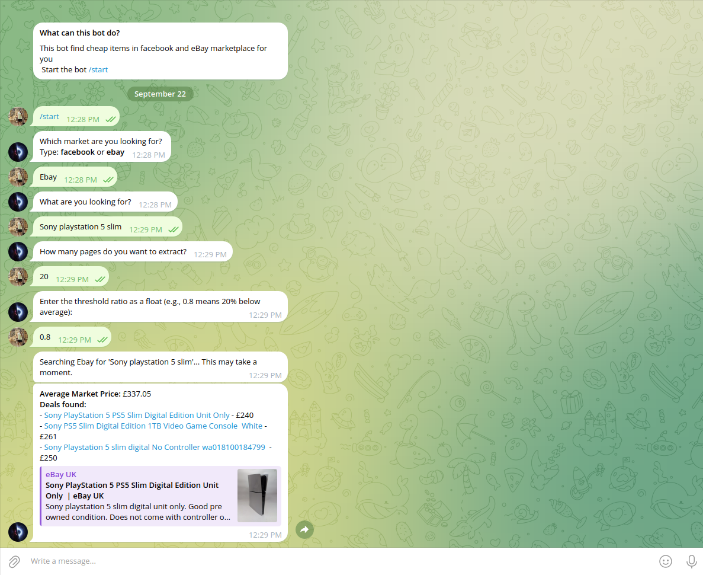
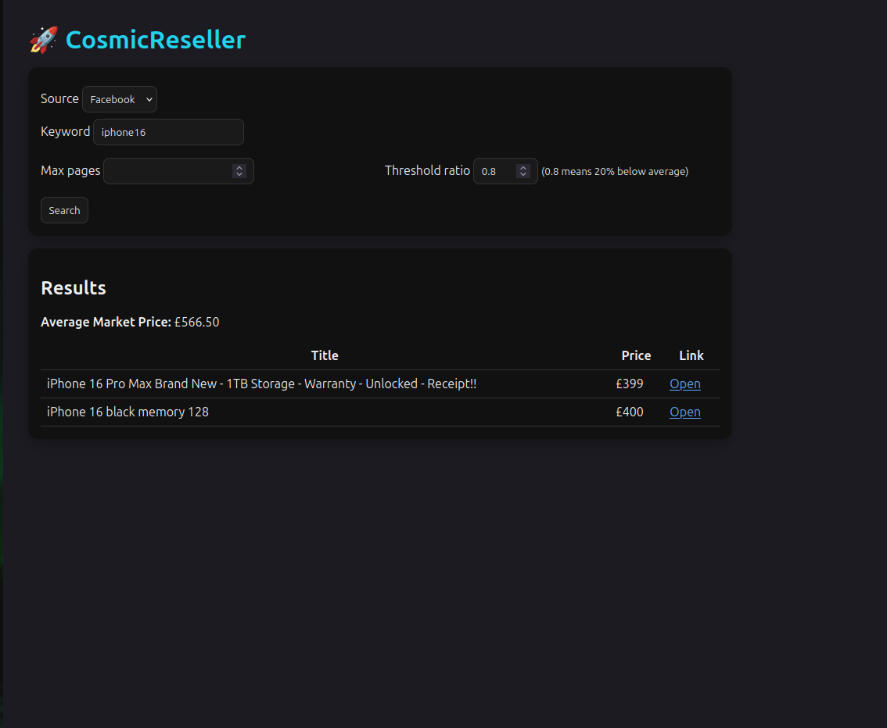

# 🚀 CosmicReseller  
_Automated price tracker for eBay & Facebook Marketplace with Telegram alerts and Web UI._


---

## ✨ What is CosmicReseller?

CosmicReseller is a tool for **resellers and deal hunters**.  
It monitors eBay and Facebook Marketplace, calculates average prices, and alerts you when items are significantly cheaper than market value.

- 🔍 Scrape listings from eBay & Facebook Marketplace  
- 💰 Compute average price & filter by threshold (e.g. 20% below average)  
- 📬 Receive alerts via **Telegram bot**  
- 🌐 Browse results in a clean **Web UI (Quart)**  
- 🐳 Run locally or in **Docker**  

---

## 📦 Installation

### Local Setup
```bash
git clone https://github.com/yourusername/CosmicReseller.git
cd CosmicReseller

python -m venv .venv
source .venv/bin/activate   # Linux/macOS
.venv\Scripts\activate      # Windows

pip install -e .[dev]
python -m playwright install
```

### Docker Setup
```bash
docker compose up --build
```
Web UI will be available at [http://localhost:8000](http://localhost:8000).  
Telegram bot runs inside the same container.

---

## ⚙️ Configuration

Create a `.env` file in the project root:

```env
# Telegram
TOKEN=your-telegram-bot-token
CHAT_ID=your-chat-id

# eBay API
EBAY_CLIENT_ID=your-ebay-client-id
EBAY_CLIENT_SECRET=your-ebay-client-secret

# Optional
# PLAYWRIGHT_PROFILE_DIR=/app/playwright_profile
```

👉 Use `.env.example` as a template.  

---

## 🚀 Usage

Run both Telegram bot + Web UI:
```bash
python -m src.cosmicreseller.main
```

Web UI only:
```bash
hypercorn -b 0.0.0.0:8000 src.cosmicreseller.webui:app
```

---

## 📸 Screenshots

> 💡 **Tip:** Use detailed keywords when searching.  
> For example, “iPhone 13 Pro Max case” will yield more accurate results than just “iPhone.”

- Telegram Alert  
  

- Web UI – Search Page  
  

---

## 📂 Project Structure

```
src/cosmicreseller/
├── pricing.py           # Price parsing & filtering
├── scrapers/            # eBay & Facebook scrapers
├── telegram_bot.py      # Telegram bot
├── webui/               # Quart web interface
├── main.py              # Orchestrator (bot + web UI)
├── logger.py            # Logging config
tests/                   # Unit & integration tests
docs/                    # Images, docs, screenshots
```

---

## 🤝 Contributing

Contributions welcome!  
- Fork the repo  
- Create a feature branch  
- Submit a pull request  

Please run tests before submitting:
```bash
pytest
```
